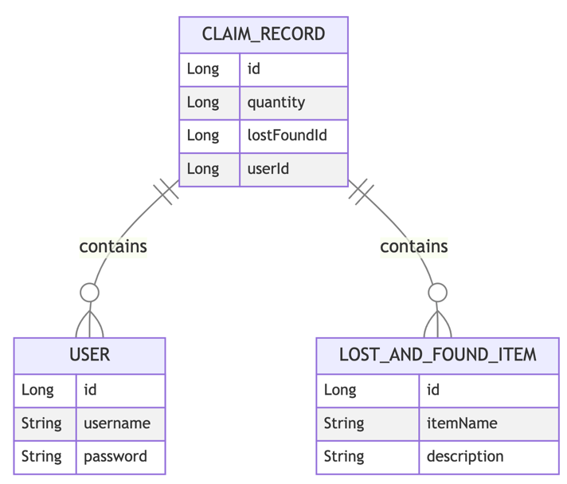

# Lost And Found Application

This is a lost & found application that reads lost items from a file (e.g. PDF) provided by Admin and stores the extracted information. Users of this application can read the stored lost items and claim it.

## Requirement

The project need to expose 4 endpoints, that can talk to database layer.

| OPERATION | ENDPOINT       | DESCRIPTION                                                                                                                                                                                                                           |
|-----------|----------------|---------------------------------------------------------------------------------------------------------------------------------------------------------------------------------------------------------------------------------------|
| POST      | /lost-items    | Upload & Store Data: A REST API Admin endpoint to upload the lost items with details from a file. The application should extract and store the following information from the uploaded file:LostItem:o ItemName: o Quantity: o Place: |
| GET       | /lost-items    | A REST API user endpoint to read the saved Lost Items                                                                                                                                                                                 |
| POST      | /claims        | A REST API user endpoint for users to claim the lost item. User 1001 claimed certain items and certain quantities from the retreived list (2) and store them with their user id.                                                                                                                                                                           |
| GET       | /claims        | A REST API Admin endpoint to read all the Lost items and Users (userId and name) associated with that.                                                                                                                                   | 

## Skill set used

- Java 21
- SpringBoot
- POSTGRES Database
- Liquibase
- Testcontainers
- Docker
- Test Driven Development (TDD)

## How to run locally

Since this project uses the postgres instance to support our operations.

- 1. Need to start the postgres instance on your local.

> start the docker instance of the POSTGRES in the docker-compose file provided in the path
> docker-compose.yml (starts instance in port 9001) --> localhost:9001

> to verify: use your local database GUI (DBeaver, SQL Developer) 
> DB URL: "jdbc:postgresql://localhost:5432/db-lost-and-found"  
> DB USER: "lafdbuser" 
> DB PASSWORD: "lafdbpassword" 

- 2. Liquibase Migrations

Liquibase allows you to specify the database change you want using SQL or several different database-agnostic formats,
including XML, YAML, and JSON. Developers can abstract the database code to make it extremely easy to push out changes
to different database types.

Liquibase script will run as part of the application startup, which will create the database and the required tables.

- 3. Start the application locally using the command
> mvn spring-boot:run

by running the above script creates the actual DB changes defined in src/main/resources/db/changelog is replicated in the dockerized
postgres instance that is created.

- 4. Mock Data
  User_details table have been prepared with the following data from the liquibase script.
> src/main/resources/db/changelog/changes/data/user-details.csv

## WE ARE READY?

let's start the microservice project, so by default it will start on the port localhost:8081 now!

All the endpoints are secured using basic auth and users credentials is stored in-memory. Use the below credentials to access the endpoints.
### Admin
- username: admin
- password: password
- role: ADMIN
### User
- username: user
- password: password
- role: USER

## Swagger API

> Access Swagger API page on the URL **http://localhost:8081/swagger-ui.html**

### Table Definition

